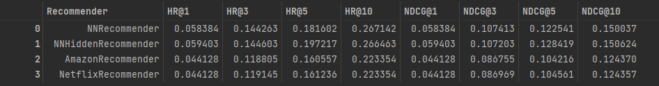

# Neural Network Recommender
Neural Network Recommender for Recommending the Best Possible Hotel Stay

The Aim of this project was to create a neural network recommender which, for given users, would recommend the best possible hotel stays. The main goal was to beat Amazon's recommender which was trained on the same dataset.

## Preparing data 
The <code>users_df</code> dataframe was one-hot encoded, and the user features were normalized by calculating the probability for each value.
On the other hand, the <code>items_df</code> dataframe was only one-hot encoded

## Neural Networks
Recommender can use two of the avaiable Neural Networks: 
-<b>MyDropoutNet:</b> This neural network is designed with a main feature of a dropout layer, along with a single ReLU layer. 
-<b>MyHiddenNet:</b> This neural network is characterized by two hidden layers.

There were plans to create a neural network with embedding layers but I wasn't able to do it.

## Tuning

## Requirements 
To run this notebook without issues you need to install the following libraries:

1. Install python >= 3.8
2. Install following libraries: 
<code>numpy</code>
<code>pandas</code>
<code>matplotlib</code>
<code>seaborn</code>
<code>hyperopt</code>
<code>collections</code>
<code>torch</code>
<code>livelossplot</code>
You can either use conda or pip
3. The recommender is implemented in the file <code>project_2_recommender_and_evaluation.ipynb</code>. However, before running this file, it is necessary to execute <code>project_1_data_preparation.ipynb</code> as it performs the required data preparation steps. Running it ensures that the data is properly prepared and ready for use by the recommender system.

all the necessary data is in the repository
